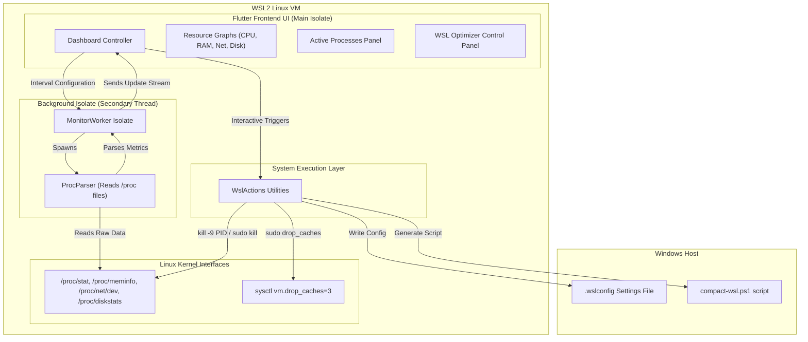

# WSL Monitor & Optimization Suite

`wsl_monitor` is a premium, high-performance Linux desktop application optimized specifically for WSL2 (Windows Subsystem for Linux 2) environments. It provides a glassmorphic dashboard tracking system-wide resource diagnostics, granular process details, kernel cache RAM reclamation tools, and an interactive config manager for the Windows host's `.wslconfig` setup.

---

## 🏗️ Architecture

The application is architected around a non-blocking background isolate worker to prevent CPU parsing bottlenecks on the Flutter UI thread. The system flow is illustrated below:



---

## 📊 Technical Datasheet & Features

| Feature | Specification | Mechanism / Under-the-Hood |
| :--- | :--- | :--- |
| **RAM Cache Reclaim** | Manual / Automated drop cache control | Non-interactive root execution of `sysctl -w vm.drop_caches=3` |
| **Windows Config Sync** | Reads & modifies `.wslconfig` GUI-side | Raw INI Parser reading and writing to `/mnt/c/Users/gbast/.wslconfig` |
| **Disk Compactor** | PowerShell script builder | Generates standard `diskpart` script at `C:\Users\gbast\compact-wsl.ps1` |
| **Process Manager** | Real-time filter & termination | Parsed `/proc/[pid]/stat` metrics with standard/sudo `kill -9` hooks |
| **Telemetry System** | Live graphs & hardware logs | Polled parsing of `/proc/stat`, `/proc/meminfo`, `/proc/net/dev` |
| **Aesthetics** | Premium High-Fidelity Glassmorphism | Dark HSL color tokens with custom Canvas graph renderers |

---

## 🚀 Getting Started

### Prerequisites
Ensure that you have installed the necessary dependencies on your WSL instance:
```bash
sudo apt update
sudo apt install -y clang cmake ninja-build pkg-config libgtk-3-dev liblzma-dev
```

### System-Wide Global Command Setup
The Flutter and Dart SDK binaries, along with the `wsl_monitor` production executable, are deployed under `/usr/local/bin`:
- Run `wsl_monitor` directly from any console window to launch the application.

---

## 🛠️ Build and Compilation

### Run in Debug mode
```bash
flutter run -d linux
```

### Build Release Bundle
```bash
flutter build linux --release
```
The output executable will be built at `build/linux/x64/release/bundle/wsl_monitor`.
